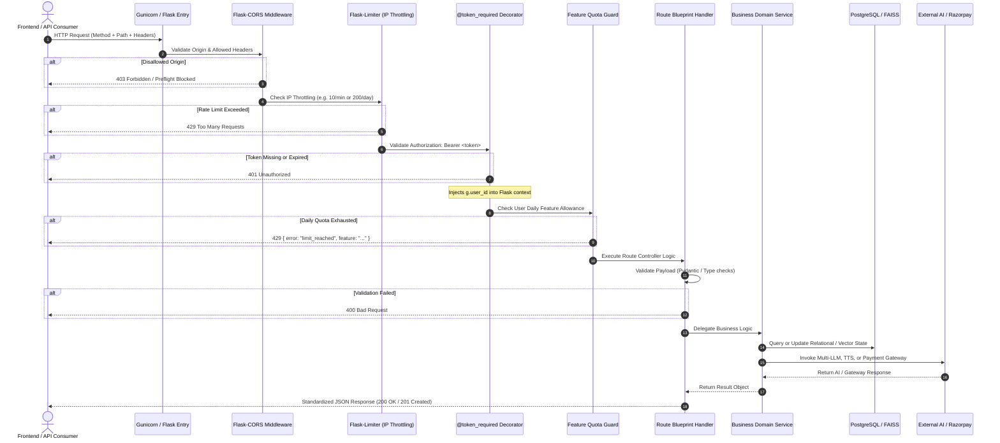
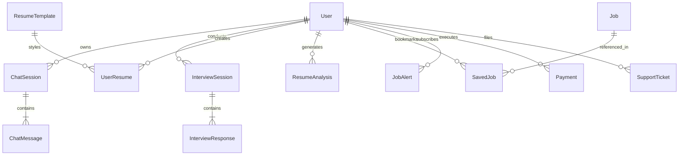

# Backend Documentation — NirVexa

> High-performance Flask REST API service powering intelligent job search, resume ATS analysis, LaTeX compilation, real-time voice interviews, semantic search, and payment processing for NirVexa.

---

## Overview

The NirVexa backend is an enterprise-grade RESTful API built on **Python 3.11**, **Flask 3.0**, **PostgreSQL**, and **SQLAlchemy 2.0**. It acts as the central intelligence engine for the platform, orchestrating:

* **Multi-LLM Gateway**: Intelligent failover routing across Groq (Llama 3.3 70B), Google Gemini (2.5 Flash), DeepSeek (Chat/Coder), and Mistral AI.
* **AI Mock Interview Engine**: Audio/text interview generation, real-time speech evaluation, fluency metrics, and filler word detection.
* **Resume Intelligence & LaTeX Engine**: Multi-format resume parsing (PDF via `pdfplumber`), ATS matching, and compilation of publication-quality PDFs via a local Tectonic LaTeX engine.
* **Vector Semantic Search**: High-dimensional FAISS vector indexing (`faiss-cpu`) for semantic matching of candidate profiles against scraped job descriptions.
* **Multi-Source Job Aggregator**: Automated scraping pipeline ingesting opportunities from global tech boards with deduplication and normalization.
* **Autonomous Web Research (AI Engine Phase 1)**: SSRF-guarded search and content extraction pipeline with streaming size limits and canonical URL deduplication.
* **Security & Monetization**: JWT access/refresh token authentication, two-factor OTP team administration, Redis/in-memory rate limiting, feature usage quotas, and Razorpay billing.

---

## Technology Stack

| Component | Technology | Version | Purpose |
| :--- | :--- | :--- | :--- |
| **Language & Runtime** | Python | `3.11.9` / `3.10.11` | Backend application execution runtime |
| **Web Framework** | Flask | `3.0.3` | Lightweight, modular WSGI application framework |
| **WSGI Server** | Gunicorn | `25.3.0` | Production HTTP process manager and request server |
| **Database** | PostgreSQL | 15+ / 16 | Relational persistence layer for application entities |
| **Database Driver** | psycopg2-binary | `2.9.9` | C-optimized PostgreSQL database adapter |
| **ORM Layer** | SQLAlchemy / Flask-SQLAlchemy | `2.0.36` / `3.1.1` | Object-relational mapping, connection pooling, and transactions |
| **Database Migrations** | Flask-Migrate / Alembic | `4.0.7` | Version-controlled schema migrations |
| **Authentication & Tokens** | PyJWT | `2.9.0` | Secure HS256 JWT access and refresh token signing |
| **Password Hashing** | Flask-Bcrypt / bcrypt | `1.0.1` | Salted Blowfish cryptographic password hashing |
| **Rate Limiting** | Flask-Limiter / Limits | `3.8.0` / `5.8.0` | IP-based request throttling with Redis/memory storage |
| **CORS Management** | Flask-Cors | `4.0.1` | Cross-Origin Resource Sharing header enforcement |
| **AI — Groq** | groq | `0.11.0` | Ultra-low latency Llama 3.3 70B inference client |
| **AI — Google Gemini** | google-generativeai | `0.8.5` | Multimodal and text generation via Gemini 2.5 Flash |
| **AI — DeepSeek & Mistral** | openai / mistralai | `1.51.0` / `1.0.3` | DeepSeek and Mistral AI API clients |
| **Vector Search** | faiss-cpu | `1.13.2` | Dense vector similarity index for semantic job matching |
| **Data Validation** | Pydantic v2 | `2.8.2` | Type enforcement and schema validation |
| **PDF Text Extraction** | pdfplumber | `0.11.4` | High-fidelity text and layout extraction from uploaded resumes |
| **LaTeX Compilation** | Tectonic Engine | `v0.15.0` | Standalone TeX/LaTeX-to-PDF compilation binary |
| **Background Scheduler** | APScheduler | `3.10.4` | Background job execution for scrapers, alerts, and index builds |
| **Job Scrapers** | BeautifulSoup4 / Requests | `4.12.3` / `2.32.3` | HTML parsing, RSS feed ingestion, and API fetching |
| **Voice & Audio** | ElevenLabs / Edge-TTS / gTTS | `1.x` / `6.1.12` | Text-to-speech audio synthesis for voice interviews |
| **Payments** | Razorpay SDK | `>=1.3.0` | Payment order creation and webhook signature verification |
| **Email Services** | SendGrid / Resend | `6.12.5` / `2.29.0` | Transactional OTP, job alerts, and password reset dispatches |
| **Testing Suite** | Pytest / Pytest-Flask | `8.3.3` / `1.3.0` | Unit, integration, and security regression testing |

---

## Why These Technologies?

### Python 3.11 & Flask 3.0
* **What:** High-productivity language paired with a lightweight microframework.
* **Where:** Application entry point (`run.py`), application factory (`app/__init__.py`), and route blueprints.
* **How:** Organized via the Flask Application Factory pattern with modular Blueprints.
* **Why:** Provides minimal overhead, broad AI/ML library support, rapid development velocity, and strict control over middleware execution.

### PostgreSQL & SQLAlchemy 2.0
* **What:** Enterprise relational database with an asynchronous-capable modern ORM.
* **Where:** Core data layer (`app/models/`, `app/database/`).
* **How:** Handles transactions, foreign key cascades, unique constraints, and PostgreSQL-native `ARRAY` columns for user skills and target roles.
* **Why:** Guarantees ACID compliance, reliable indexing for fast lookups, and auto-reconnecting connection pools (`pool_pre_ping=True`, `pool_recycle=300`).

### FAISS (Facebook AI Similarity Search)
* **What:** Specialized library for efficient similarity search of dense vectors.
* **Where:** `app/services/rag_pipeline.py`.
* **How:** Embeds job listings into vectors and queries `nyrvexa_jobs.index` using L2/cosine distance against user search queries.
* **Why:** Delivers sub-millisecond semantic search across thousands of job records without requiring expensive external vector database subscriptions.

### Tectonic LaTeX Engine
* **What:** Modernized, self-contained TeX/LaTeX processing engine.
* **Where:** `app/services/latex_compiler.py` utilizing `tectonic.exe` / system tectonic binary.
* **How:** Compiles user resume data into professional, ATS-optimized PDF documents with zero external dependency on heavy TeXLive distributions.
* **Why:** Provides deterministic, publication-quality typography that passes corporate Applicant Tracking Systems (ATS) flawlessly.

---

## Architecture

```mermaid
graph TD
    subgraph Client["Client Applications"]
        FrontendSPA[NirVexa Frontend - React 19]
        TeamAdmin[Team Admin Portal]
    end

    subgraph Entry["Entry & Server Layer"]
        Gunicorn[Gunicorn WSGI Server]
        AppFactory[Flask Application Factory - create_app]
    end

    subgraph Middleware["Security & Throttling Middleware"]
        CORS[Flask-CORS Origin Guard]
        Limiter[Flask-Limiter IP Throttler]
        AuthMW[JWT Token Required Middleware]
        UsageMW[Feature Quota Guard - feature_usage]
    end

    subgraph Routing["Blueprints & API Endpoints"]
        AuthBP[/api/auth - Authentication]
        ChatBP[/api/chat - AI Career Chat]
        InterviewBP[/api/interview - Mock Interview]
        JobsBP[/api/jobs - Job Board & Search]
        ResumeBP[/api/resume - ATS & LaTeX Builder]
        CareerBP[/api/career - Path & Salary]
        AdminBP[/api/admin - Team Portal]
        PaymentBP[/api/payment - Razorpay Orders]
        AIEngineBP[/api/ai - Autonomous Research]
    end

    subgraph Services["Domain Services & Engines"]
        LLMRouter[Multi-LLM Router - Groq/Gemini/DeepSeek]
        InterviewService[Interview Engine & Audio Evaluator]
        ResumeService[ATS Parser & Tectonic LaTeX Compiler]
        FAISSEngine[FAISS Semantic Vector Index]
        ScraperEngine[Job Scrapers & Deduplicator]
        Scheduler[APScheduler Background Daemon]
        AIEngine[WebResearchEngine - Search & Fetch]
    end

    subgraph Persistence["Storage & Persistence"]
        Postgres[(PostgreSQL Database)]
        FAISSFile[(nyrvexa_jobs.index)]
    end

    subgraph External["External Services & APIs"]
        GroqAPI[Groq Llama 3.3]
        GeminiAPI[Google Gemini 2.5]
        RazorpayAPI[Razorpay Gateway]
        EmailAPI[SendGrid / Resend]
        JobAPIs[Job Feeds / APIs]
    end

    FrontendSPA --> Gunicorn
    TeamAdmin --> Gunicorn
    Gunicorn --> AppFactory
    AppFactory --> CORS
    CORS --> Limiter
    Limiter --> AuthMW
    AuthMW --> UsageMW
    UsageMW --> Routing

    Routing --> Services
    Services --> Persistence
    Services --> External
```

---

## Folder Structure

```text
nirvexa-backend/
│
├── app/                        # Application core package
│   ├── ai_engine/              # Autonomous Web Research Engine (Phase 1)
│   │   ├── extraction/         # HTML text & metadata extractor (ContentExtractor)
│   │   ├── fetch/              # SSRF-guarded HTTP fetcher with streaming size limit
│   │   ├── schemas/            # Pydantic v2 schemas for search and research
│   │   ├── search/             # Provider abstractions (DuckDuckGo provider)
│   │   ├── coordinator.py      # WebResearchEngine orchestrator
│   │   └── __init__.py         # AI Engine blueprint initialization
│   │
│   ├── database/               # Database initialization and connection hooks
│   │   ├── db.py               # SQLAlchemy db instance and init_db()
│   │   └── __init__.py
│   │
│   ├── middleware/             # HTTP request processing hooks
│   │   ├── auth_middleware.py  # @token_required JWT verification decorator
│   │   ├── rate_limiter.py     # IP rate limiting and daily feature quota counters
│   │   └── __init__.py
│   │
│   ├── models/                 # SQLAlchemy relational data models (16 models)
│   │   ├── admin_job.py        # Team-posted job openings
│   │   ├── chat_message.py     # Chat dialogue message entity
│   │   ├── chat_session.py     # Multi-turn chat conversation container
│   │   ├── interview_response.py # Question-level interview evaluation
│   │   ├── interview_session.py  # Mock interview session record
│   │   ├── job.py              # Aggregated job board entity
│   │   ├── job_alert.py        # Job email notification preference
│   │   ├── news_cache.py       # Cached tech news item
│   │   ├── payment.py          # Razorpay transaction history
│   │   ├── resume_analysis.py  # Parsed ATS resume report
│   │   ├── resume_template.py  # Resume template definition
│   │   ├── saved_job.py        # User saved/bookmarked job relation
│   │   ├── skill_match.py      # Job skill match evaluation record
│   │   ├── support_ticket.py   # Customer support ticket
│   │   ├── user.py             # User profile, credentials, and settings
│   │   ├── user_resume.py      # User authored resume document
│   │   └── __init__.py
│   │
│   ├── routes/                 # Flask Blueprints defining REST endpoints
│   │   ├── admin.py            # User management, support tickets, and team jobs
│   │   ├── ai_engine.py        # Autonomous research search endpoint
│   │   ├── auth.py             # Registration, login, Google OAuth, refresh, logout
│   │   ├── career.py           # Career path, skill gap, salary, and company research
│   │   ├── chat.py             # Career assistant chat sessions and messages
│   │   ├── interview.py        # Interview preparation, live evaluation, and audio
│   │   ├── jobs.py             # Job search, filtering, semantic matching, and alerts
│   │   ├── news.py             # Tech and industry news feeds
│   │   ├── payment.py          # Razorpay plan retrieval, order creation, verification
│   │   ├── profile.py          # Public profile rendering and user preferences
│   │   ├── resume.py           # Resume ATS analysis, LaTeX builder, compilation
│   │   ├── roadmap_graph.py    # Career roadmap node-link graph data
│   │   ├── usage.py            # Daily feature quota status and remaining counts
│   │   ├── user.py             # Saved jobs and alert management
│   │   └── __init__.py
│   │
│   ├── services/               # Core business and algorithmic services
│   │   ├── career_service.py   # Career roadmap generation and skill gaps
│   │   ├── email_service.py    # SendGrid and Resend email dispatches
│   │   ├── interview_service.py# AI interview generation, evaluation, filler analysis
│   │   ├── job_inserter.py     # Database insertion with deduplication
│   │   ├── job_scraper.py      # Multi-source remote job scraper
│   │   ├── latex_compiler.py   # Tectonic-based LaTeX compilation to PDF
│   │   ├── llm_router.py       # Multi-model LLM failover gateway
│   │   ├── news_service.py     # RSS news ingestion and caching
│   │   ├── payment_service.py  # Razorpay order generation and webhook verification
│   │   ├── rag_pipeline.py     # FAISS semantic vector search index manager
│   │   ├── resume_builder_service.py # Section AI enhancement and template filling
│   │   ├── roadmap_graph_service.py  # Career skill graph traversal
│   │   ├── scheduler.py        # APScheduler recurring task registrations
│   │   ├── team_admin_auth.py  # Two-factor OTP generation and verification
│   │   ├── tts_service.py      # Neural TTS audio generation
│   │   └── __init__.py
│   │
│   ├── utils/                  # Cryptography and response formatting helpers
│   │   ├── helpers.py          # JWT generation/decoding, standardized responses
│   │   └── __init__.py
│   │
│   ├── extensions.py           # Extension singletons (db, bcrypt, migrate)
│   └── __init__.py             # Application factory function create_app()
│
├── docs/                       # Architecture documentation
├── migrations/                 # Alembic database migration versions
├── tests/                      # Automated test suite
│   ├── test_ai_engine_phase1.py # 26 comprehensive Phase 1 tests
│   └── test_elevenlabs.py      # Audio service validation test
│
├── config.py                   # Centralized environment configuration
├── Procfile                    # Production process definition (gunicorn run:app)
├── requirements.txt            # Python dependency manifest
├── run.py                      # Application entry script
├── runtime.txt                 # Python runtime version declaration (python-3.11.9)
├── tectonic.exe                # Local Tectonic LaTeX compilation binary
└── README.md                   # Client-facing platform overview
```

---

## Folder-by-Folder Explanation

| Directory | Purpose | Key Responsibilities |
| :--- | :--- | :--- |
| `app/ai_engine` | Web Research Engine | Contains the autonomous search, SSRF validator, streaming fetcher, HTML content extractor, and coordinator orchestrating web research. |
| `app/database` | Database Layer | Initializes SQLAlchemy, handles connection pooling parameters, and binds the session to Flask. |
| `app/middleware` | Request Interceptors | Contains JWT verification (`auth_middleware.py`) and IP-based rate limiting + feature quota enforcement (`rate_limiter.py`). |
| `app/models` | Data Models | Defines all 16 SQLAlchemy entities, table schemas, primary keys, relationships, cascades, and serializing `to_dict()` methods. |
| `app/routes` | API Endpoints | Modular Flask Blueprints encapsulating HTTP route handlers, request validation, and status code responses. |
| `app/services` | Business Logic | Isolates complex logic including LLM failovers, interview evaluation, resume compilation, scrapers, and vector indexing. |
| `app/utils` | Utility Helpers | Exposes cryptographically secure JWT issuance, decoding, token validation, and JSON response envelopes. |
| `tests` | Automated Testing | Pytest suite validating authentication, SSRF boundaries, rate limiting, and coordinator regression scenarios. |

---

## API Architecture & Request Lifecycle

Every HTTP request traverses a structured lifecycle guaranteeing authentication, quota governance, input validation, and secure execution:



---

## API Endpoints

### 1. Authentication (`/api/auth`)
| Method | Endpoint | Description | Auth Required |
| :--- | :--- | :--- | :--- |
| `POST` | `/api/auth/register` | Register new user account with email, name, password | No |
| `POST` | `/api/auth/login` | Authenticate user credentials and return access + refresh tokens | No |
| `POST` | `/api/auth/google` | Verify Google OAuth ID token and authenticate/create user | No |
| `POST` | `/api/auth/refresh` | Exchange valid refresh token for a fresh short-lived access token | No (Refresh Token Body) |
| `POST` | `/api/auth/logout` | Revoke active user session and refresh token | Yes |
| `GET` | `/api/auth/me` | Retrieve profile and subscription data for authenticated user | Yes |
| `PUT` | `/api/auth/me` | Update personal profile details, bio, links, and preferences | Yes |
| `PUT` | `/api/auth/change-password`| Update user password after verifying existing password | Yes |
| `POST` | `/api/auth/forgot-password`| Dispatch password reset email with temporary token | No |
| `POST` | `/api/auth/reset-password` | Validate reset token and establish new password | No |

### 2. AI Career Assistant (`/api`)
| Method | Endpoint | Description | Auth Required |
| :--- | :--- | :--- | :--- |
| `POST` | `/api/chat/sessions` | Create a new isolated conversation thread | Yes |
| `GET` | `/api/chat/sessions` | List all conversation sessions for authenticated user | Yes |
| `PATCH`| `/api/chat/sessions/<id>` | Rename conversation session title | Yes |
| `DELETE`| `/api/chat/sessions/<id>`| Delete conversation session and all related messages | Yes |
| `POST` | `/api/chat` | Send user prompt and receive AI streaming response with model routing | Yes |
| `GET` | `/api/chat/history` | Retrieve full message history for a specific session | Yes |
| `DELETE`| `/api/chat/history` | Clear message history for a session | Yes |

### 3. AI Mock Interview (`/api/interview`)
| Method | Endpoint | Description | Auth Required |
| :--- | :--- | :--- | :--- |
| `POST` | `/api/interview/start` | Initialize interview session (role, difficulty, question generation) | Yes |
| `POST` | `/api/interview/generate` | Dynamically generate tailored interview questions | Yes |
| `POST` | `/api/interview/evaluate` | Evaluate transcribed response (fluency, depth, accuracy, filler words) | Yes |
| `POST` | `/api/interview/react` | Generate real-time conversational reaction to candidate answer | Yes |
| `POST` | `/api/interview/session` | Persist or finalize overall mock interview session | Yes |
| `GET` | `/api/interview/sessions`| Fetch historical interview sessions and scores | Yes |
| `GET` | `/api/interview/session/<id>` | Retrieve detailed score report for a specific interview session | Yes |
| `DELETE`| `/api/interview/session/<id>`| Delete interview session record | Yes |
| `POST` | `/api/interview/speak` | Generate neural TTS speech audio for interview question | Yes |
| `POST` | `/api/interview/text-prep` | Generate written interview preparation questions | Yes |
| `POST` | `/api/interview/text-evaluate` | Score written text answers | Yes |

### 4. Job Board & Semantic Search (`/api/jobs`)
| Method | Endpoint | Description | Auth Required |
| :--- | :--- | :--- | :--- |
| `GET` | `/api/jobs` | Query jobs with keyword, location, type, and pagination filters | Yes |
| `GET` | `/api/jobs/premium` | Fetch exclusive high-tier job postings for subscribers | Yes (Pro/Premium) |
| `GET` | `/api/jobs/filters/options`| Retrieve dynamic filter options (companies, locations, job types) | Yes |
| `GET` | `/api/jobs/<job_id>` | Retrieve detailed job listing | Yes |
| `POST` | `/api/jobs/match` | Match user resume or skill profile against target job description | Yes |
| `GET` | `/api/jobs/saved` | Fetch bookmarked jobs for authenticated user | Yes |
| `POST` | `/api/jobs/saved` | Save a job listing to user's saved list | Yes |
| `PUT` | `/api/jobs/saved/<id>` | Update application status or notes on saved job | Yes |
| `DELETE`| `/api/jobs/saved/<id>` | Remove job from saved list | Yes |
| `POST` | `/api/jobs/alerts` | Create automated email notification alert for job criteria | Yes |
| `GET` | `/api/jobs/alerts` | List active job alert subscriptions | Yes |
| `DELETE`| `/api/jobs/alerts/<id>`| Cancel job alert subscription | Yes |
| `GET` | `/api/jobs/admin/faiss-status` | Inspect status of dense vector index | Admin |
| `POST` | `/api/jobs/admin/rebuild-index`| Force rebuild of FAISS semantic search index | Admin |

### 5. Resume Center & LaTeX Builder (`/api/resume`)
| Method | Endpoint | Description | Auth Required |
| :--- | :--- | :--- | :--- |
| `POST` | `/api/resume/analyze` | Parse PDF resume, calculate ATS score, extract skills and gaps | Yes |
| `GET` | `/api/resume/history` | List historical resume analyses | Yes |
| `GET` | `/api/resume/templates`| List available LaTeX resume templates | Yes |
| `GET` | `/api/resume/templates/<id>`| Fetch LaTeX template source code and schema | Yes |
| `POST` | `/api/resume/build` | Generate structured resume JSON from user input | Yes |
| `POST` | `/api/resume/build-jd`| Tailor resume content to a specific target job description | Yes |
| `POST` | `/api/resume/enhance` | Enhance specific resume section bullet points using AI | Yes |
| `POST` | `/api/resume/compile` | Compile LaTeX code into PDF via local Tectonic engine | Yes |
| `GET` | `/api/resume/history/<id>`| Fetch single saved user resume | Yes |
| `PATCH`| `/api/resume/draft/<id>`| Save draft modifications to user resume | Yes |
| `DELETE`| `/api/resume/history/<id>`| Delete saved user resume | Yes |

### 6. Career Intelligence (`/api/career`)
| Method | Endpoint | Description | Auth Required |
| :--- | :--- | :--- | :--- |
| `POST` | `/api/career/path` | Generate personalized step-by-step career progression roadmap | Yes |
| `POST` | `/api/career/skill-gap`| Compare user skills to target role and identify missing proficiencies | Yes |
| `GET` | `/api/jobs/salary-insights` | Calculate salary percentiles by role, experience, and location | Yes |
| `POST` | `/api/career/company-research` | Gather structured intelligence on target company culture and hiring | Yes |
| `GET` | `/api/roadmap-graph/list` | List available engineering career roadmaps | No |
| `GET` | `/api/roadmap-graph/<id>` | Fetch skill node-link graph for interactive visualization | No |

### 7. Monetization & Usage (`/api`)
| Method | Endpoint | Description | Auth Required |
| :--- | :--- | :--- | :--- |
| `GET` | `/api/user/usage` | Fetch current daily usage counts and remaining limits per feature | Optional / Yes |
| `GET` | `/api/payment/plans` | Fetch available subscription tiers (Free, Pro, Premium) and pricing | No |
| `POST` | `/api/payment/create-order` | Generate authenticated Razorpay order ID | Yes |
| `POST` | `/api/payment/verify` | Verify Razorpay payment signature and activate subscription | Yes |
| `POST` | `/api/payment/webhook` | Process asynchronous payment webhook notifications | No (HMAC Signature) |
| `GET` | `/api/payment/status` | Query active subscription plan status and expiry date | Yes |

### 8. Team Administration (`/api/admin`)
| Method | Endpoint | Description | Auth Required |
| :--- | :--- | :--- | :--- |
| `GET` | `/api/admin/team/setup-status` | Verify team admin configuration status | No |
| `POST` | `/api/admin/team/login` | Initiate team admin login and dispatch email OTP | No |
| `POST` | `/api/admin/team/verify-otp` | Verify two-factor OTP and establish team admin session | No |
| `GET` | `/api/admin/team/session` | Check active team admin session validity | Team Admin |
| `POST` | `/api/admin/team/resend-otp` | Re-send two-factor OTP to authorized team email | No |
| `GET` | `/api/admin/jobs` | List all team-posted opportunities | Team Admin |
| `POST` | `/api/admin/jobs` | Post new job opening directly to the platform | Team Admin |
| `PATCH`| `/api/admin/jobs/<job_id>` | Edit job listing details or toggle active status | Team Admin |
| `DELETE`| `/api/admin/jobs/<job_id>` | Delete team-posted job opening | Team Admin |
| `GET` | `/api/admin/stats` | System metrics (total users, active resumes, interview counts) | Team Admin |
| `GET` | `/api/admin/users` | List platform users with filter options | Team Admin |
| `DELETE`| `/api/admin/users/<user_id>` | Terminate user account | Team Admin |
| `PATCH`| `/api/admin/users/<user_id>/premium` | Manually grant or revoke user premium privileges | Team Admin |

### 9. AI Autonomous Web Research (`/api/ai`)
| Method | Endpoint | Description | Auth Required |
| :--- | :--- | :--- | :--- |
| `POST` | `/api/ai/research/search` | Execute authenticated, rate-limited web research with SSRF protection | Yes |

### 10. System & Utilities
| Method | Endpoint | Description | Auth Required |
| :--- | :--- | :--- | :--- |
| `GET` | `/api/health` | Health check endpoint returning status, version, and environment | No |
| `POST` | `/api/tts` | Standalone text-to-speech generation audio endpoint | No |
| `GET` | `/api/news` | Retrieve curated tech news feed | No |

---

## Database Models & Relationships

The database utilizes 16 SQLAlchemy entities. Primary keys are UUID strings (`VARCHAR(36)`) generated via `uuid.uuid4()`.



### Key Models Summary

| Model | Table Name | Description | Key Attributes |
| :--- | :--- | :--- | :--- |
| `User` | `users` | Primary user identity and profile entity | `id`, `email`, `password_hash`, `google_id`, `skills` (ARRAY), `target_roles` (ARRAY), `is_premium`, `premium_expiry` |
| `ChatSession` | `chat_sessions` | Multi-turn conversation container | `id`, `user_id`, `title`, `created_at`, `updated_at` |
| `ChatMessage` | `chat_messages` | Single turn in a chat conversation | `id`, `session_id`, `role` (user/assistant), `content`, `tokens` |
| `InterviewSession` | `interview_sessions`| Mock interview attempt | `id`, `user_id`, `role`, `difficulty`, `overall_score`, `status`, `duration` |
| `InterviewResponse`| `interview_responses`| Single question answer and evaluation | `id`, `session_id`, `question_text`, `transcript`, `accuracy_score`, `depth_score`, `feedback` |
| `Job` | `jobs` | Aggregated job postings | `id`, `title`, `company`, `location`, `description`, `salary`, `url`, `source`, `tags` |
| `SavedJob` | `saved_jobs` | User bookmark and application tracker | `id`, `user_id`, `job_id`, `status` (saved, applied, interviewing), `notes` |
| `JobAlert` | `job_alerts` | Automated email alert criteria | `id`, `user_id`, `keywords`, `location`, `frequency`, `last_sent` |
| `ResumeAnalysis` | `resume_analyses` | ATS audit report | `id`, `user_id`, `ats_score`, `skills` (JSON), `missing_skills` (JSON), `feedback_json` |
| `ResumeTemplate` | `resume_templates`| Available LaTeX resume layouts | `id`, `name`, `thumbnail_url`, `latex_source`, `category` |
| `UserResume` | `user_resumes` | Stored user-authored resume documents | `id`, `user_id`, `title`, `template_id`, `resume_data` (JSON), `pdf_url`, `latex_code` |
| `Payment` | `payments` | Razorpay transactions and orders | `id`, `user_id`, `razorpay_order_id`, `razorpay_payment_id`, `amount`, `status`, `plan` |
| `SupportTicket` | `support_tickets` | User helpdesk inquiries | `id`, `user_id`, `subject`, `message`, `status`, `priority` |
| `AdminJob` | `admin_jobs` | Jobs posted directly by team admins | `id`, `title`, `company`, `location`, `salary`, `application_link`, `is_active` |
| `NewsCache` | `news_cache` | Cached RSS news articles | `id`, `title`, `summary`, `source_url`, `source_name`, `published_at`, `category` |
| `FeatureUsage` | `feature_usage` | Daily per-user feature quota tracker | `id`, `user_id`, `feature`, `used_date`, `count` (Unique index on `user_id, feature, used_date`) |

---

## Authentication & Security

1. **Password Security**: Passwords are encrypted using Blowfish-based salted hashes generated by `Flask-Bcrypt` (`bcrypt.generate_password_hash`).
2. **JWT Token Strategy**:
   * **Access Tokens**: Short-lived (default 1 hour), signed with `HS256`, containing user ID in subject (`sub`) claim. Stored in JavaScript memory on the frontend.
   * **Refresh Tokens**: Long-lived (default 30 days), stored in browser `localStorage`, verified and exchanged via `/api/auth/refresh`.
3. **Team Admin Two-Factor Authentication**:
   * Access to `/teamadmin` requires primary credentials validated against `TEAM_ADMIN_EMAIL` and `TEAM_ADMIN_PASSWORD`.
   * A 6-digit cryptographically generated OTP is dispatched to `TEAM_ADMIN_ALERT_EMAIL`.
   * Session is granted only upon OTP verification via `/api/admin/team/verify-otp`.
4. **Autonomous AI Engine SSRF Protection (`app/ai_engine/fetch`)**:
   * Validates target hostnames and resolved IP addresses against IPv4/IPv6 private blocks (`10.0.0.0/8`, `172.16.0.0/12`, `192.168.0.0/16`).
   * Blocks localhost (`127.0.0.1`, `::1`), link-local (`169.254.0.0/16`), and AWS/GCP/Azure cloud metadata addresses (`169.254.169.254`).
   * Enforces redirect safety by re-validating every HTTP redirect hop.
   * Streams responses up to a strict 2MB cap to prevent memory exhaustion / decompression bomb attacks.
5. **Rate Limiting & Quota Throttling**:
   * Global IP throttle: `200 per day, 50 per hour` via `Flask-Limiter`.
   * Per-endpoint limits: e.g. `10 per minute` on `/api/ai/research/search`.
   * Daily feature allowance managed via `feature_usage` database table (e.g. Free users: 7 chat messages/day, 1 ATS analysis/day, 3 interview sessions/day).
6. **CORS Governance**: Configured strictly to allow authorized production domains (`nyrvexa.in`, `nyrvexa-frontend.vercel.app`) and local development ports (`http://localhost:5173`).

---

## Environment Configuration

Create a `.env` file in the root of `nirvexa-backend`. **Never expose production secrets in version control.**

```env
# Flask Environment
FLASK_ENV=development
APP_NAME=NyrVexa
APP_VERSION=1.0.0
SECRET_KEY=<your-secret-key>

# Database Connection (PostgreSQL in production, SQLite in test)
SQLALCHEMY_DATABASE_URI=postgresql://<user>:<password>@<host>:5432/<database_name>

# JWT Cryptography
JWT_SECRET_KEY=<your-jwt-secret-key>
JWT_ACCESS_TOKEN_EXPIRES_HOURS=1
JWT_REFRESH_TOKEN_EXPIRES_DAYS=30

# AI Provider API Keys
GROQ_API_KEY=<your-groq-api-key>
GEMINI_API_KEY=<your-google-gemini-api-key>
DEEPSEEK_API_KEY=<your-deepseek-api-key>
MISTRAL_API_KEY=<your-mistral-api-key>

# Dedicated Interview AI Keys (Optional fallbacks)
GROQ_INTERVIEW_API_KEY=
GEMINI_INTERVIEW_API_KEY=
MISTRAL_INTERVIEW_API_KEY=

# Google OAuth
GOOGLE_CLIENT_ID=<your-google-client-id>.apps.googleusercontent.com

# Razorpay Billing
RAZORPAY_KEY_ID=<your-razorpay-key-id>
RAZORPAY_KEY_SECRET=<your-razorpay-key-secret>
RAZORPAY_WEBHOOK_SECRET=<your-razorpay-webhook-secret>

# Email Dispatch
RESEND_API_KEY=<your-resend-api-key>
SENDGRID_API_KEY=<your-sendgrid-api-key>

# Team Admin Credentials
TEAM_ADMIN_EMAIL=team@nyrvexa.in
TEAM_ADMIN_PASSWORD=<strong-team-admin-password>
TEAM_ADMIN_ALERT_EMAIL=team@nyrvexa.in
# Local development only: fixed OTP (leave empty in production)
TEAM_ADMIN_DEV_OTP=

# AI Engine Feature Flags
AI_ENGINE_ENABLED=false
AI_ENGINE_SEARCH_PROVIDER=duckduckgo
AI_ENGINE_FETCH_TIMEOUT_SECONDS=5
AI_ENGINE_MAX_FETCH_WORKERS=4

# Rate Limiter Storage (Defaults to memory:// in local dev)
RATELIMIT_STORAGE_URL=memory://
```

---

## Installation & Setup

### Prerequisites
* **Python**: Version `3.10.x` or `3.11.x`.
* **PostgreSQL**: Version 14 or higher (or Docker PostgreSQL container).
* **Tectonic** (Optional for local LaTeX resume compilation): Windows binary `tectonic.exe` is included in the root directory.

### Installation Steps

1. Navigate to the backend directory:
   ```bash
   cd nirvexa-backend
   ```

2. Create and activate a Python virtual environment:
   ```bash
   # Windows
   python -m venv venv
   .\venv\Scripts\activate

   # Linux / macOS
   python3 -m venv venv
   source venv/bin/activate
   ```

3. Install required packages:
   ```bash
   pip install -r requirements.txt
   ```

4. Initialize environment variables:
   ```bash
   cp .env.example .env
   # Edit .env with your PostgreSQL credentials and API keys
   ```

5. Initialize the database schema:
   ```bash
   python create_tables.py
   # Or run Flask-Migrate
   flask db upgrade
   ```

6. Seed initial templates and job categories (optional):
   ```bash
   python run_seed.py
   ```

7. Start the development server:
   ```bash
   python run.py
   ```
   The API will listen at `http://localhost:5000`. Test health via:
   ```bash
   curl http://localhost:5000/api/health
   ```

---

## Testing

The backend includes a comprehensive automated test suite powered by **Pytest**:

```bash
# Run the complete test suite
.\venv\Scripts\python.exe -m pytest -v

# Run targeted AI Engine Phase 1 tests (26 test cases)
.\venv\Scripts\python.exe -m pytest tests/test_ai_engine_phase1.py -v
```

### Test Coverage Highlights
* **SSRF Guard**: Verifies direct and redirect SSRF blocking to localhost, private IP subnets, and cloud metadata (`169.254.169.254`).
* **Streaming Limit**: Confirms downloads exceeding 2MB are aborted immediately without buffer overflow.
* **URL Normalization**: Confirms deduplication, tracking parameter removal (`utm_*`), and case normalization.
* **Authentication**: Verifies JWT requirements and rejection of unauthenticated requests.
* **Coordinator**: Verifies correct pairing of extracted HTML content to canonical normalized search results.

---

## Production Deployment

### Production WSGI Execution
In production, the application is managed via **Gunicorn** as declared in `Procfile`:

```text
web: gunicorn run:app
```

Recommended production invocation:
```bash
gunicorn --workers 4 --threads 2 --timeout 120 --bind 0.0.0.0:$PORT run:app
```

### Deployment on Render
1. Create a new **Web Service** connected to `nirvexa-backend`.
2. Set Runtime to **Python 3**.
3. Build Command: `pip install -r requirements.txt`
4. Start Command: `gunicorn run:app`
5. Supply environment variables in the Render dashboard.

---

## Performance Considerations

* **Connection Pooling**: SQLAlchemy pool pre-pinging (`pool_pre_ping=True`) prevents stale connection errors across cloud restarts.
* **Local In-Memory Vector Search**: FAISS eliminates external database network roundtrips for semantic job matching.
* **Multi-Threaded Web Research**: Web fetching utilizes a bounded `ThreadPoolExecutor` (default 4 workers) with strict 5-second per-request timeouts.
* **Asynchronous Scheduling**: Long-running scraper jobs and news ingestion run via `APScheduler` in daemon threads without blocking client HTTP request handling.

---

## Known Limitations

* **Tectonic Platform Dependency**: Local LaTeX compilation relies on `tectonic.exe` on Windows; Linux deployment environments require `tectonic` installed via package manager or container.
* **In-Memory Rate Limiting**: When running without Redis (`RATELIMIT_STORAGE_URL=memory://`), rate limits reset on server process restarts. Production scaling requires setting `REDIS_URL`.
* **Synchronous Web Scraping**: Job scraping is triggered via scheduled batch jobs; large scraper runs should ideally be decoupled via Celery / Redis Queue for high-volume enterprise scaling.

---

## Future Improvements

### Recommended
* Integrate **Redis Queue (RQ)** or **Celery** for distributed background worker tasks.
* Deploy **Prometheus / Grafana** metrics middleware for real-time latency and error tracking.
* Expand unit test coverage across resume and interview routes.

### Optional
* Implement WebSockets for streaming LLM generation tokens to client in real time.
* Add read-replica database support for high-throughput job queries.
